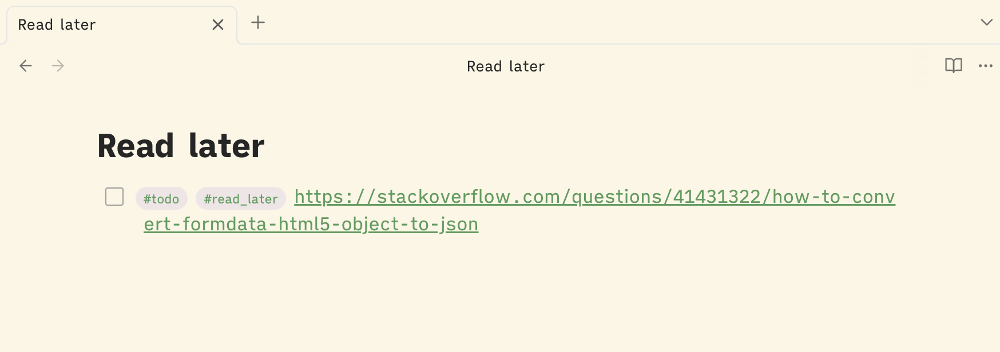
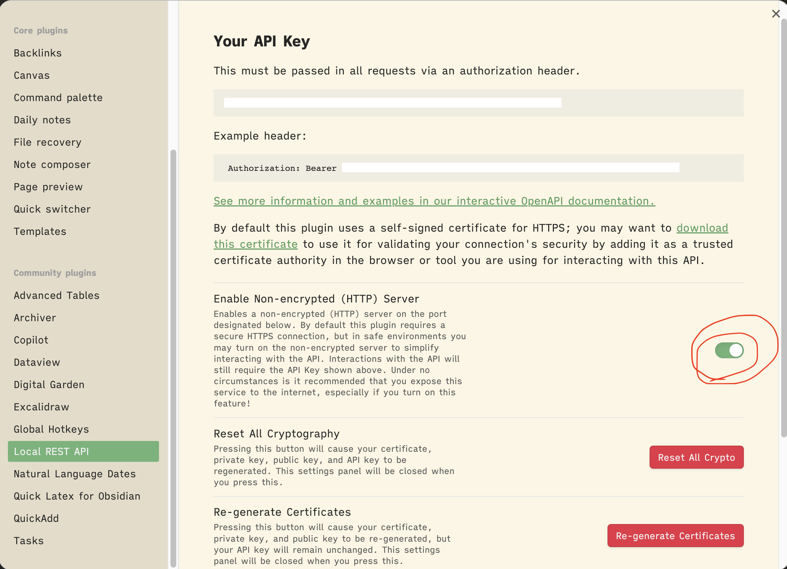
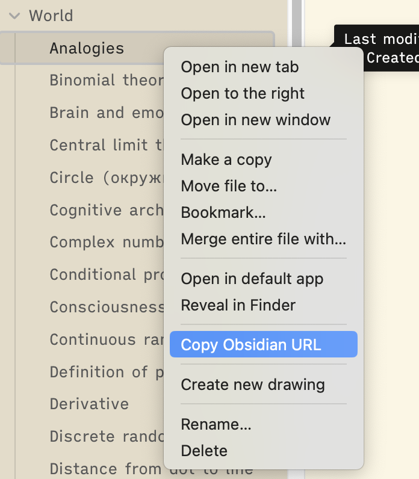

# obsidian-simple-read-later

Save URLs to your Obsidian vault with a click of a button to read them later!

> *Requires Obsidian running in background!*

## Installation

1. Install and enable [Obsidian Local REST API](https://github.com/coddingtonbear/obsidian-local-rest-api) extension.
2. Enable non-encrypted HTTP server for Obsidian Local REST API.
    
3. Copy the API key
4. When you first try to save any link, the extension is going to open its settings. Insert the API key there and click "Save".
5. Enjoy!

## Config

### Path in Obsidian

By default the extension saves your URLs to "Read Later" note at the root of your vault. 

You can set it to any note you want:
1. Copy the Obsidian URL of the note
    
2. Extract the note path from the URL
    
3. Set it in the extension's settings
